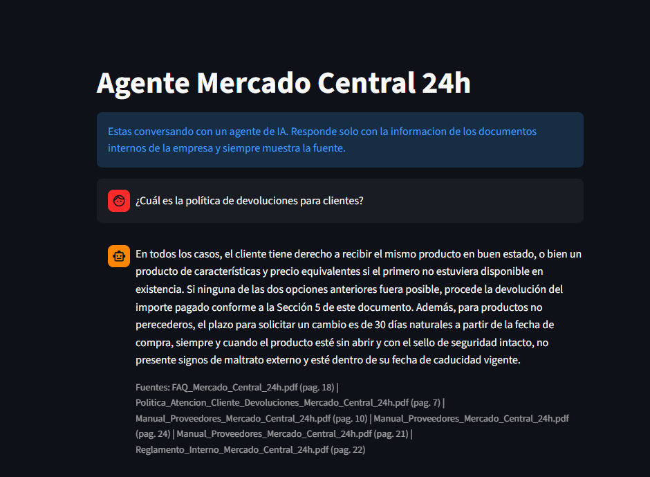

# Agente RAG - Mercado Central 24h

Proyecto del Challenge Alura Agente (ONE: IA for Tech).

Es un agente de IA que responde preguntas sobre los documentos internos de
Mercado Central 24h, un supermercado que atiende 24/7. La idea es que cualquier
colaborador pueda preguntar en lenguaje normal y obtener la respuesta al
instante, sin tener que abrir los PDFs y buscar a mano.

## El problema

La empresa tiene el reglamento interno, la politica de devoluciones, el manual
de proveedores, un FAQ y una planilla de inventario con 200 productos. Son mas
de 120 paginas. Cuando alguien necesita saber algo puntual (por ejemplo cuantos
dias hay para devolver un producto) tiene que ponerse a buscar en los archivos.

Este agente resuelve eso: se le pregunta y el busca la respuesta en los
documentos.

## Como funciona

Usa RAG (Retrieval-Augmented Generation), que basicamente son estos pasos:

1. Se leen los documentos y se corta el texto en pedazos chicos (chunks).
2. Cada pedazo se convierte en numeros (embeddings) y se guarda en FAISS.
3. Cuando llega una pregunta, se busca cuales pedazos se parecen mas.
4. Esos pedazos se le pasan al modelo junto con la pregunta.
5. El modelo arma la respuesta usando solo esa informacion.

```
pregunta -> busqueda en FAISS -> fragmentos relevantes
                                        |
                                        v
                              modelo Gemini -> respuesta + fuentes
```

El agente siempre muestra de que archivo y de que pagina saco la informacion,
asi se puede verificar. Y si la respuesta no esta en los documentos, avisa que
no la encontro en vez de inventarla.

## Documentos que usa

| Archivo | Categoria |
|---|---|
| Politica_Atencion_Cliente_Devoluciones....pdf | Atencion al Cliente |
| FAQ_Mercado_Central_24h.pdf | Preguntas Frecuentes |
| Reglamento_Interno_Mercado_Central_24h.pdf | Recursos Humanos |
| Manual_Proveedores_Mercado_Central_24h.pdf | Compras y Proveedores |
| inventario_de_supermercado_latam.xlsx | Inventario |

Los PDF se leen con PyPDF y el Excel con Pandas. Como una planilla no es texto
corrido, cada fila se convierte en una frase repitiendo el nombre de las
columnas.

## Tecnologias

- Python
- LangChain
- PyPDF y Pandas para leer los archivos
- Google Gemini (embeddings `text-embedding-004` y modelo `gemini-2.0-flash`)
- FAISS como base vectorial
- Streamlit para la interfaz
- Oracle Cloud Infrastructure (OCI) para el deploy

## Archivos del proyecto

```
├── data/                            los 5 documentos
├── agente_mercado_central.ipynb     notebook donde desarrolle y probe todo
├── crear_base.py                    lee los documentos y crea la base vectorial
├── app.py                           la interfaz web
├── requirements.txt
├── .env.example
└── README.md
```

## Como ejecutarlo

Hace falta una API key de Google Gemini, se saca gratis en
[Google AI Studio](https://aistudio.google.com/app/apikey).

```bash
git clone https://github.com/julianoffs/challenge-alura-agente.git
cd challenge-alura-agente

python -m venv venv
venv\Scripts\activate          # en Linux o Mac: source venv/bin/activate
pip install -r requirements.txt
```

Copiar `.env.example` a `.env` y poner la clave adentro:

```
GOOGLE_API_KEY=tu_clave_aca
```

Despues:

```bash
python crear_base.py       # crea la base vectorial (se hace una sola vez)
streamlit run app.py       # levanta la pagina
```

Se abre en `http://localhost:8501`.

Tambien se puede abrir el notebook `agente_mercado_central.ipynb` con Jupyter,
que es donde esta el desarrollo paso a paso de cada etapa.

## Ejemplos de preguntas

- Cual es la politica de devoluciones?
- Que beneficios tiene el programa Cliente VIP Central?
- Cuantas unidades de Arroz Integral 1kg hay en el inventario?
- Cuales son los canales de atencion al cliente?
- Que necesito para dar de alta un proveedor nuevo?

## Ejemplos de respuestas

**Pregunta:** Que beneficios tiene el programa Cliente VIP Central?

**Respuesta:**
> (pegar aca la respuesta real que devuelve el agente)

Fuentes: FAQ_Mercado_Central_24h.pdf (pag. 5)

---

**Pregunta:** Cuantas unidades de Arroz Integral 1kg hay?

**Respuesta:**
> (pegar aca la respuesta real que devuelve el agente)

Fuentes: inventario_de_supermercado_latam.xlsx

## Registro de ejecucion

Cada pregunta que se le hace al agente queda guardada en
`registro_preguntas.jsonl`, con la fecha, la pregunta, la respuesta, las fuentes
que uso y cuanto tardo en responder. Sirve para revisar despues si esta
respondiendo bien.

Ejemplo de una linea del registro:

```json
{"fecha": "2026-07-27T18:30:12", "pregunta": "Cual es la politica de devoluciones?", "respuesta": "...", "fuentes": ["Politica_Atencion_Cliente_Devoluciones_Mercado_Central_24h.pdf (pag. 12)"], "segundos": 2.4}
```

## Deploy

La aplicacion esta desplegada y accesible publicamente.

- Enlace: (pegar aca la URL de la app)
- Captura de pantalla:



## Autor

[@julianoffs](https://github.com/julianoffs) - Challenge Alura Agente, ONE IA for Tech
